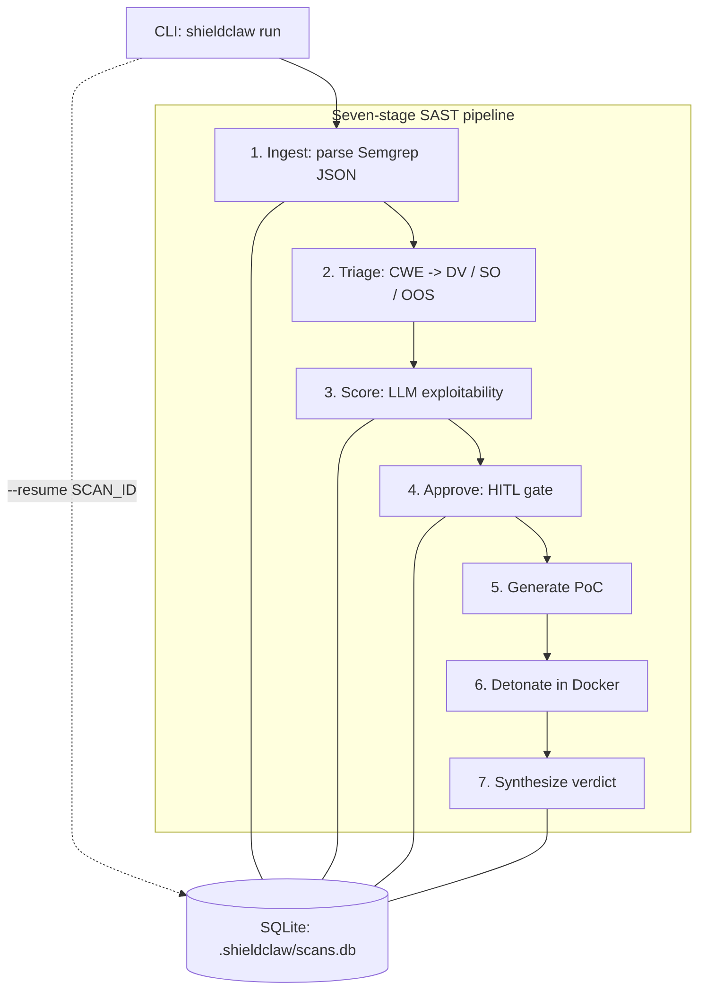

# ShieldClaw

> Evidence-backed SAST verification for Semgrep findings.
>
> `main` is ahead of the `v0.2.0` tag and currently includes interactive approvals,
> JSON/SARIF/Markdown reporting, conservative CWE conflict handling, and additional
> sandbox hardening. See [CHANGELOG](./CHANGELOG.md) and the
> [v0.2.0 release notes](https://github.com/blondres04/shieldclaw/releases/tag/v0.2.0).

ShieldClaw is a CLI tool that turns Semgrep findings into evidence-backed
true/false-positive verdicts. It asks an LLM to generate a targeted
proof-of-concept exploit, detonates that exploit inside a hardened ephemeral
Docker sandbox, collects observer evidence, and produces a deterministic verdict
with a mandatory human approval gate before any live exploit fires.

## Highlights

- Evidence-backed verdicts: ShieldClaw combines exploit exit codes with observer corroboration before marking a finding `TRUE_POSITIVE`.
- Human approval by default: approvals are persisted in SQLite, with optional inline `--interactive` review for demos and live walkthroughs.
- Hardened detonation: attacker containers run read-only, on isolated Docker networking, with a default seccomp profile and tight CPU/memory/PID limits.
- Recruiter-friendly outputs: the same scan can be exported as JSON, SARIF, or Markdown for CI systems, code scanning workflows, and portfolio review.
- Clean project structure: the Git repo root holds docs, fixtures, and supporting assets; the installable Python package lives in [`shield-claw/`](./shield-claw/).

## Why it exists

Static analysis tools surface possible vulnerabilities, but they do not confirm
exploitability. Medium-sized codebases can produce hundreds of findings, many of
which are false positives that still require manual review. ShieldClaw automates
the confirmation step for findings that are safe to validate dynamically.

## Architecture



### Package layout

```text
shield-claw/
|-- src/shieldclaw/
|   |-- ingest/          Parse Semgrep JSON into Finding objects
|   |-- triage/          CWE-based classifier
|   |-- scoring/         LLM exploitability scoring
|   |-- approval/        Human approval gate logic
|   |-- context/         Repo and source excerpt aggregation helpers
|   |-- observer/        Exit-code and corroboration observers
|   |-- verdict/         Deterministic verdict synthesis
|   |-- persistence/     SQLite scan and finding state
|   |-- intelligence/    LLM provider abstractions and PoC generation
|   |-- sandbox/         Docker orchestration and detonation
|   |-- reporting/       JSON, SARIF, and Markdown report builders
|   |-- models.py        Shared frozen dataclasses and ABCs
|   |-- exceptions.py    Project error hierarchy
|   `-- orchestrator.py  Cross-boundary wiring
|-- tests/
|-- docker/
`-- scripts/
```

Strict module isolation is enforced by `shield-claw/tests/test_architecture.py`.

## Quickstart

Commands below use POSIX line continuations and inline environment-variable syntax.
On PowerShell, set environment variables separately (for example,
`$env:SHIELDCLAW_AUTO_APPROVE = "1"`) and keep the same repo-relative paths.

Before you start, make sure:

- Docker Desktop / Docker Engine is running
- An LLM backend is reachable: either Ollama is running with your chosen model pulled, or `OPENAI_API_KEY` is set for `--provider openai`
- `semgrep` is installed in the active environment
- On Windows PowerShell, if `semgrep` raises a `charmap` / Unicode error, set `$env:PYTHONUTF8 = "1"` before running it

```bash
# 1. Clone
git clone git@github.com:blondres04/shieldclaw.git
cd shieldclaw

# 2. Create a virtual environment
python -m venv .venv

# 3. Activate it
# macOS / Linux
source .venv/bin/activate
# Windows PowerShell
# .\.venv\Scripts\Activate.ps1

# 4. Install runtime and dev dependencies
pip install -r shield-claw/requirements.txt \
            -r shield-claw/requirements-dev.txt \
            -e shield-claw/

# 5. Install Semgrep for the quickstart scan
pip install semgrep

# 6. Install pre-commit hooks
pre-commit install

# 7. Build the pre-baked attacker image
docker build \
  -f shield-claw/docker/attacker.Dockerfile \
  -t ghcr.io/blondres04/shieldclaw-attacker:0.1 \
  shield-claw/

# 8. Run Semgrep against the bundled vulnerable Flask lab
semgrep --config=auto \
        --json \
        -o ./findings.json \
        test_repos/vulnerable-flask-app/

# 9. Run ShieldClaw end to end
SHIELDCLAW_AUTO_APPROVE=1 python -m shieldclaw run \
    --target test_repos/vulnerable-flask-app \
    --semgrep-output ./findings.json \
    --provider ollama \
    --timeout 60

# 10. Optional variant: write Markdown or SARIF instead of JSON stdout
SHIELDCLAW_AUTO_APPROVE=1 python -m shieldclaw run \
    --target test_repos/vulnerable-flask-app \
    --semgrep-output ./findings.json \
    --provider ollama \
    --output-format markdown \
    --output ./shieldclaw-report.md
```

Expected terminal outcome:

```json
{
  "pipeline_error": null,
  "scan_id": "f8897ef8-9178-43cf-ad89-c760a7112165",
  "findings": [
    {
      "rule_id": "python.lang.security.audit.formatted-sql-query.formatted-sql-query",
      "triage_verdict": "DYNAMICALLY_VERIFIABLE",
      "state": "VERDICTED"
    }
  ]
}
```

Exact rule IDs, finding counts, and final verdicts vary with the Semgrep version,
rule pack, and LLM model/provider you use. A healthy quickstart run exits `0`,
returns a non-null `scan_id`, and emits a JSON report with populated `findings`.

The `run` command writes a JSON report to stdout by default and logs triage /
detonation progress to stderr. To inspect persisted scan state afterward:

```bash
python -m shieldclaw status --target test_repos/vulnerable-flask-app
```

## Configuration

### Environment variables

| Variable | Default | Description |
| --- | --- | --- |
| `OLLAMA_BASE_URL` | `http://localhost:11434` | Ollama daemon endpoint |
| `OLLAMA_MODEL` | `gemma3:4b` | Model tag for Ollama |
| `OPENAI_API_KEY` | none | Required when `--provider openai` |
| `OPENAI_BASE_URL` | `https://api.openai.com/v1` | Override for API-compatible endpoints |
| `OPENAI_MODEL` | `gpt-4o-mini` | Model name for OpenAI |
| `SHIELDCLAW_ATTACKER_IMAGE` | `ghcr.io/blondres04/shieldclaw-attacker:0.1` | Pre-built attacker image tag |
| `SHIELDCLAW_AUTO_APPROVE` | none | Set to `1` to skip the approval gate |
| `SHIELDCLAW_LOG_LEVEL` | `INFO` | Logging verbosity |

### `shieldclaw run` flags

| Flag | Default | Description |
| --- | --- | --- |
| `--target PATH` | required | Repository root containing `docker-compose.yml` or `docker-compose.yaml` |
| `--diff PATH` | none | Optional unified diff for the legacy diff-driven workflow |
| `--semgrep-output PATH` | none | Semgrep `--json` report for the SAST pipeline |
| `--provider` | `ollama` | LLM backend: `ollama` or `openai` |
| `--timeout` | `15` | Detonation timeout in seconds |
| `--resume SCAN_ID` | none | Resume an interrupted scan |
| `--output PATH` | stdout | Write the report to a file |
| `--output-format` | `json` | Report format: `json`, `sarif`, or `markdown` |
| `--interactive` | `false` | Prompt inline for each approval decision |

### `shieldclaw status` flags

| Flag | Description |
| --- | --- |
| `--target PATH` | Filter scans by target directory (defaults to the current working directory) |
| `--scan-id SCAN_ID` | Show one specific persisted scan |

### `shieldclaw approve` flags

| Flag | Description |
| --- | --- |
| `SCAN_ID FINDING_ID` | Approve a single finding |
| `SCAN_ID --all-pending` | Approve or reject every pending finding |
| `SCAN_ID --auto` | Auto-approve all pending findings |
| `--reject` | Reject instead of approve |
| `--note TEXT` | Persist an audit note with the decision |
| `--target PATH` | Directory containing the `.shieldclaw/scans.db` store (defaults to the current working directory) |

## What `main` adds beyond `v0.2.0`

- Inline interactive approval mode via `--interactive`
- JSON, SARIF, and Markdown report output formats
- Conservative multi-CWE conflict handling with unmapped-CWE warnings
- Retry-on-refusal handling for LLM-generated PoCs
- Observer warning surfacing in report output
- Target service-name validation before detonation
- Stronger sandbox controls through network egress blocking and seccomp defaults

## Architectural invariants

- Module isolation: cross-feature imports are blocked except for the CLI / orchestrator integration boundary and the documented `scoring -> intelligence` allowlist enforced by `shield-claw/tests/test_architecture.py`.
- Immutable data flow: shared values are frozen dataclasses.
- Subprocess discipline: the sandbox layer uses `subprocess.run`, not `Popen`.
- Guaranteed teardown: detonation cleanup runs even on failures and interrupted flows.
- Sandbox hardening: attacker containers run with strict memory, CPU, PID, filesystem, and network constraints.

## Limitations and roadmap

- Semgrep input only: SARIF/CodeQL/Snyk/Checkmarx ingest remains a backlog item even though report export supports SARIF.
- No web UI yet: approval is CLI-driven today, with browser or API workflows still planned.
- Patch-and-verify is not implemented yet: ADRs 009 and 010 describe the intended design.
- Triage is still rule-based: an LLM-backed triage path is planned, but not shipped.
- Observer tiers 3 and 4 are still backlog items, so some runs can end `INCONCLUSIVE`.
- Exploit payloads are Python-only today.

## Repository housekeeping

- Default branch history is linear and issue-driven.
- Completed AFK-safe issues `#38` through `#49` are implemented on `main`.
- Open backlog items are intentionally limited to larger product work such as patch-and-verify, richer observers, and broader input support.

## License and responsible use

See [LICENSE](./LICENSE) and [RESPONSIBLE_USE.md](./RESPONSIBLE_USE.md).

Use ShieldClaw only against systems you own or are explicitly authorized to test.
Generated exploits are real attack code and should be handled as offensive security tooling.
