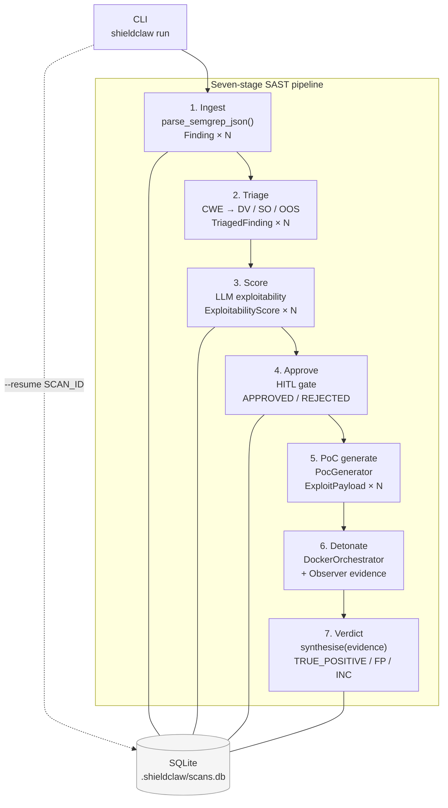

# ShieldClaw — SAST Verification Engine

> **v0.2 pivot in progress on branch `pivot/sast-verifier`.**
> See [CHANGELOG](./CHANGELOG.md) for the full change log.

ShieldClaw is a CLI tool that turns Semgrep findings into evidence-backed
True / False Positive verdicts. It feeds each finding to an LLM to generate
a targeted proof-of-concept exploit, detonates it inside a hardened ephemeral
Docker sandbox, collects multi-tier observer evidence, and synthesises a
deterministic verdict — with a mandatory human-in-the-loop approval gate
before any live exploit fires.

---

## Why it exists

Static analysis tools produce findings; they don't confirm exploitability.
A typical scan of a medium-size codebase returns hundreds of findings, 30–60%
of which are false positives that require manual triage. ShieldClaw automates
the confirmation step: for each finding classified as dynamically verifiable,
it attempts to exploit it. Exit code 0 + corroborating Tier-2 evidence
(filesystem diff, server logs) produces `TRUE_POSITIVE` at 95% confidence.
Exit code ≠ 0 produces `FALSE_POSITIVE`. Neither outcome trusts the exploit
script alone.

---

## Architecture



**Package layout** (strict isolation enforced by `tests/test_architecture.py`):

```
shieldclaw/
├── ingest/        parse Semgrep JSON → Finding
├── triage/        CWE-based classifier → TriagedFinding
├── scoring/       LLM exploitability scorer → ExploitabilityScore
├── approval/      HITL gate logic (pure; no DB imports)
├── observer/      DetonationObserver protocol + Tier-1/2 evidence
├── verdict/       Deterministic synthesis → Verdict
├── persistence/   SQLite ScanStore (WAL mode, parameterised queries)
├── intelligence/  LLMProvider ABC + OllamaProvider + OpenAIProvider
├── sandbox/       DockerOrchestrator (compose + detonation)
├── context/       Git diff + compose aggregator (v0.1 legacy)
├── reporting/     JSON report builder (v0.1 legacy)
├── models.py      All shared frozen dataclasses + ABCs
├── exceptions.py  ShieldClawError hierarchy
└── orchestrator.py  Cross-boundary wiring (only file permitted to do so)
```

---

## Quickstart

```bash
# 1. Clone
git clone git@github.com:blondres04/shieldclaw.git
cd shieldclaw

# 2. Create a virtual environment (Python 3.11+)
python3.11 -m venv .venv && source .venv/bin/activate

# 3. Install the package + dev tools
pip install -r shield-claw/requirements.txt \
            -r shield-claw/requirements-dev.txt \
            -e shield-claw/

# 4. Install pre-commit hooks (ruff, mypy, arch-guard run on every commit)
pre-commit install

# 5. Build the pre-built attacker image (eliminates pip-at-detonation)
cd shield-claw && bash scripts/build_attacker_image.sh && cd ..

# 6. Run Semgrep against the bundled vulnerable Flask lab
semgrep --config=auto \
        --json \
        -o /tmp/findings.json \
        test_repos/vulnerable-flask-app/

# 7. Run ShieldClaw end-to-end (auto-approve for demo; use without for HITL)
SHIELDCLAW_AUTO_APPROVE=1 python -m shieldclaw run \
    --target  test_repos/vulnerable-flask-app \
    --semgrep-output /tmp/findings.json \
    --provider ollama \
    --timeout 60

# 8. Check status
python -m shieldclaw status
```

**Expected output (last line):**
```
TRUE_POSITIVE  (confidence=0.95)  python.flask.security.injection.tainted-sql-string
```

---

## Configuration

### Environment variables

| Variable | Default | Description |
|----------|---------|-------------|
| `OLLAMA_BASE_URL` | `http://localhost:11434` | Ollama daemon endpoint |
| `OLLAMA_MODEL` | `gemma3:4b` | Model tag for Ollama |
| `OPENAI_API_KEY` | — | Required when `--provider openai` |
| `OPENAI_BASE_URL` | `https://api.openai.com/v1` | Override for API-compatible endpoints |
| `OPENAI_MODEL` | `gpt-4o-mini` | Model name for OpenAI |
| `SHIELDCLAW_ATTACKER_IMAGE` | `ghcr.io/blondres04/shieldclaw-attacker:0.1` | Pre-built attacker image tag |
| `SHIELDCLAW_AUTO_APPROVE` | — | Set to `1` to skip HITL gate (CI mode) |
| `SHIELDCLAW_LOG_LEVEL` | `INFO` | Logging verbosity (`DEBUG`, `INFO`, `WARNING`) |

### CLI flags — `shieldclaw run`

| Flag | Default | Description |
|------|---------|-------------|
| `--target PATH` | required | Repository root containing `docker-compose.yml` |
| `--semgrep-output PATH` | — | Semgrep `--json` report; enables SAST pipeline |
| `--provider` | `ollama` | LLM backend (`ollama` or `openai`) |
| `--timeout` | `15` | Detonation timeout in seconds (1–120) |
| `--resume SCAN_ID` | — | Resume a previously interrupted scan |
| `--output PATH` | stdout | JSON report sink |

### CLI flags — `shieldclaw approve`

| Flag | Description |
|------|-------------|
| `SCAN_ID FINDING_ID` | Approve a single finding |
| `SCAN_ID --all-pending` | Approve / reject all awaiting findings (logs WARN) |
| `SCAN_ID --auto` | Auto-approve all (requires `SHIELDCLAW_AUTO_APPROVE=1`) |
| `--reject` | Reject instead of approve |
| `--note TEXT` | Audit note recorded with the decision |

---

## Architectural invariants

- **Module isolation**: `context`, `ingest`, `intelligence`, `approval`, `observer`, `persistence`, `reporting`, `sandbox`, `scoring`, `triage`, and `verdict` must not import from each other. Only `orchestrator.py` and `__main__.py` cross package boundaries. Enforced by static AST analysis in `tests/test_architecture.py`.
- **Immutable data**: all inter-stage values are `@dataclass(frozen=True, slots=True)`. No mutable shared state.
- **Subprocess discipline**: `subprocess.run` only (never `Popen`). Three canonical dispatchers in `docker_orchestrator.py`.
- **Guarranteed teardown**: the `finally` block in `Orchestrator._run_legacy()` always runs teardown and report emission, even on unhandled exceptions.
- **Docker hardening**: every attacker container runs with `--memory=256m --cpus=0.5 --pids-limit=100 --user=1000:1000 --read-only --tmpfs /tmp:rw,noexec,nosuid,size=32m`.

---

## Limitations

- **No web UI**. ShieldClaw is a CLI tool. A REST API and web approval workflow are v0.3.
- **Semgrep only**. SARIF (CodeQL, Snyk) and other SAST formats are v0.3.
- **Triage classifier is rule-based**. CWE → verdict mapping covers 17 known CWEs. LLM-based triage and custom rule configuration are v0.3.
- **Observer Tiers 3 and 4 not implemented**. Network capture (Tier 3) and application-layer assertions (Tier 4) are planned. `INCONCLUSIVE` verdicts are possible when the exploit produces no filesystem side-effect.
- **Patch-and-verify loop not implemented**. ADRs 009 and 010 describe the design; Phase 5 implementation is pending.
- **Anthropic provider is a stub**. `AnthropicProvider` will be implemented in v0.3 after the Claude API schema stabilises.
- **Python-only exploit payloads**. The LLM is prompted to generate Python scripts exclusively. Multi-language exploit support is v0.3.
- **Single compose stack per scan**. ShieldClaw does not yet support multi-repository or multi-service scan aggregation.

---

## License and responsible use

See [LICENSE](./LICENSE) and [RESPONSIBLE_USE.md](./RESPONSIBLE_USE.md).

Use ShieldClaw only against systems you own or are explicitly authorised to test.
Generated exploits are real attack code that will be executed inside a Docker container.
